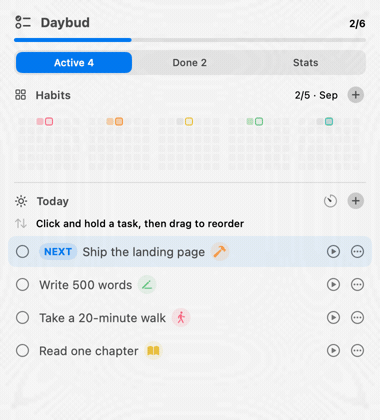
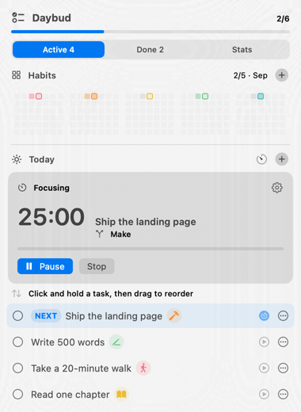
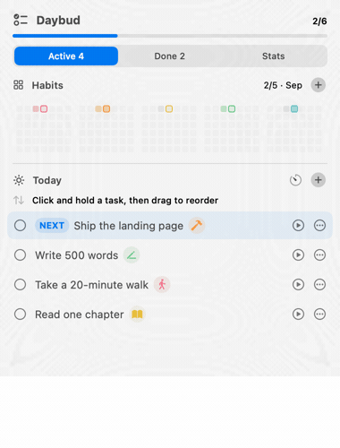

<div align="center">
  
  <h1>Daybud</h1>
  <p><strong>Your tasks, habits, and focus timer — one click from the macOS menu bar.</strong></p>
  <p>
    <a href="https://github.com/its-jovee/daybud/releases/latest">Download for macOS</a>
    ·
    <a href="#how-it-works">How it works</a>
    ·
    <a href="#privacy">Private by default</a>
  </p>
  
</div>

## A calmer way to run today

Most task apps tell you what is unfinished. Most habit apps ask you to log the same work again.

Daybud connects the two. Finish **Write 500 words** and your **Write** habit moves forward automatically. Start a focus timer straight from **Ship the landing page**. Anything unfinished is waiting for you tomorrow — without duplicating it or turning your day into a backlog-management exercise.

When today is simply too full, drag a task into **Later**. It leaves today's progress immediately, stays safely parked in a collapsed shelf, and can be dragged back whenever it becomes relevant again.

Some tasks are simply part of the week. Set **Gym** to repeat every day, or give your **Work** habit a default task on weekdays, and a fresh copy lands in Today on each of those days — even after you finished the last one.

<table>
  <tr>
    <td width="50%" align="center">
      
    </td>
    <td width="50%" align="center">
      
    </td>
  </tr>
  <tr>
    <td align="center"><strong>Finish it once.</strong><br>Daybud moves it to Done and records the linked habit.</td>
    <td align="center"><strong>Stay with the task.</strong><br>Run a Pomodoro without leaving your menu bar.</td>
  </tr>
</table>

### See where the week went

Daybud turns completed tasks into a lightweight picture of your attention. Switch between 7 and 30 days to see which habits are receiving real effort — without starting a separate time-tracking ritual.

<p align="center">
  
</p>

## How it works

1. Add the handful of things that matter today.
2. Optionally connect a task to a habit such as **Move**, **Write**, or **Make**.
3. Press play when you want a focus timer, or check the task off directly.
4. Daybud updates the habit, strengthens that day's activity square, and keeps completed work out of the way.

The result is a small loop that answers three useful questions at a glance: **What should I do next? What am I consistently investing in? Where did my time go?**

### The useful details

- Drag a task itself to reorder it — no tiny handle required.
- Park a task in the collapsed Later shelf, then drag it back into Today when you are ready.
- Make a task repeat every day, on weekdays, or on the days you pick. Unfinished copies are replaced by the next one rather than piling up.
- Give a habit a default task with **Plan a repeating task** from its menu, then manage every routine from the collapsed Repeating shelf.
- Skip a repeating task for today without touching its schedule, or stop repeating it and keep today's copy.
- Switch between Active and Done without losing completed work.
- Give every task a 25-minute estimate by default, then adjust longer work before completing it.
- See habits as compact, color-coded contribution grids.
- Open Profile for a larger activity calendar and hover any day to see the work behind it.
- Keep visible daily or weekly streaks, with a small flame moment when linked work advances one.
- Track goals such as “3 days per week” and soften habits once the goal is met.
- Give a day more intensity by completing several tasks for the same habit.
- Review task and focus activity over 7 days, 30 days, or all time.
- Get a native notification and sound when a focus session finishes.
- Carry unfinished tasks into the next day automatically.

### Main Quests & Coins

Keep up to **two active Main Quests** visible above Today. Each is an outcome with optional measurable progress, a deadline, and linked next actions. Use **Manage** to create or edit quests, attach existing tasks, add actions, or archive a priority before activating another.

Tasks stay regular by default. Choose a Main Quest in the task editor or its **Priority** menu. Quest links survive Later, next-day carryover, and repeating tasks — each day's copy of a repeating Main Quest action counts as a new action.

The compact Coin balance opens the Reward Shop and transaction history:

| Activity | Coins |
| --- | ---: |
| First completion of a Main Quest action | 10 |
| New measurable progress | 10 per quest/day |
| Habit completion | 1 per habit/day |
| Main Quest completion | 50, once |

Undo/recheck, reclassification, carryover, and reopening a completed quest do not repeat rewards. Progress corrections are allowed; only an increase beyond the quest's previous high earns progress credit. Regular tasks earn no task Coins, but can still fulfill a linked habit. Old completed work is preserved without retroactive Coins.

Customize rewards or redeem **🎮 1 hour gaming for 60 Coins**. Redemptions cannot take the balance below zero and retain the reward's name and price in history. These are local motivational Coins, not money. Stats includes a calendar-week review of Main Quest movement, meaningful days, actions, and Coins earned/spent. The Main Quest day streak uses the existing daily streak rules.

All quests, links, claims, rewards, repeating tasks, and transactions live in the same local state file. Schema 6 migrates older data automatically; tasks saved as Sidequests by earlier builds become regular tasks, and Coins they earned are kept. No personal starting quests or tasks are included in the source or app bundle.

## Download

Download the latest [`Daybud.dmg`](https://github.com/its-jovee/daybud/releases/latest), open it, and drag Daybud into Applications.

Daybud requires **macOS 14 or later** and lives in the menu bar, so it intentionally has no regular Dock window.

> Daybud is an early build. The current release is signed for development but not yet notarized for public distribution. If macOS blocks the first launch, right-click Daybud in Applications and choose **Open**.

## Privacy

Daybud has no account, cloud sync, analytics, or ads. Your tasks, habits, focus sessions, and history stay in a human-readable JSON file on your Mac.

<details>
<summary><strong>Build from source</strong></summary>

Open `TodayStack.xcodeproj` in Xcode and run the `TodayStack` scheme, or build from Terminal:

```sh
xcodebuild -scheme TodayStack -configuration Debug -destination 'platform=macOS' build
```

Run the tests with:

```sh
xcodebuild \
  -project TodayStack.xcodeproj \
  -scheme TodayStack \
  -configuration Debug \
  -destination 'platform=macOS' \
  CODE_SIGNING_ALLOWED=NO \
  test
```

</details>

<details>
<summary><strong>Local data and daily plan import</strong></summary>

Daybud stores its state in `~/.today-stack/state.json`. This legacy location is intentionally preserved so existing users keep their data after the rename.

An optional external plan can be read from `~/.today-stack/today.json`; Daybud never writes that file. The file accepts replace mode:

```json
{
  "schemaVersion": 1,
  "date": "2026-09-02",
  "mode": "replace",
  "tasks": [
    { "id": "write-500", "title": "Write 500 words", "habitSlug": "write" }
  ]
}
```

`id` is optional, `title` is required, and `habitSlug` and `durationMinutes` are optional. Tasks default to 25 minutes. A matching ID preserves completion state and its saved duration unless a new duration is supplied; a matching habit slug links the task to that habit. Reopen the menu-bar popover after changing the file.

</details>

## Contributing

Daybud is a small native SwiftUI app, and thoughtful bug reports and focused pull requests are welcome. If an interaction feels heavier than the thing it helps you do, that is especially worth reporting.

---

<div align="center">
  <sub>Made for people who want their task list to feel finite.</sub>
</div>
